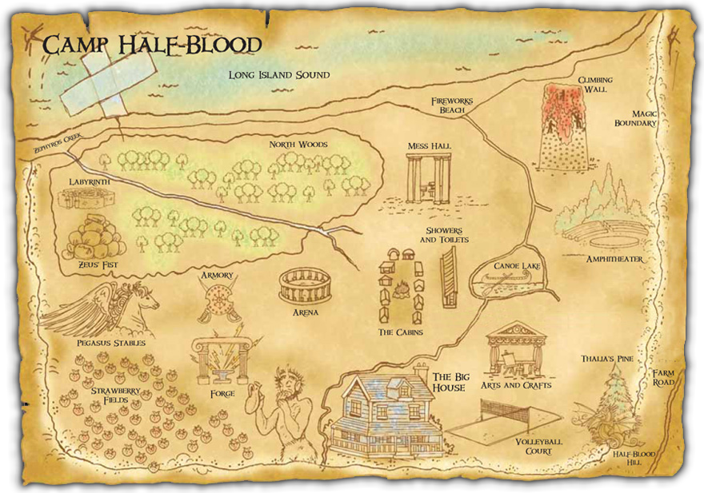

# Camp Half-Blood Rule-Based Chatbot



A simple rule-based chatbot that simulates Percy Jackson's Pegasus, guiding users to Camp Half-Blood locations like Big House, Arena, Pegasus Stable and Strawberry Fields.

## Features

- **Rule-Based Responses**: The chatbot identifies user intentions from textual input and responds with predefined actions.
- **Mythical Locations**: Includes locations such as:
  - Big House
  - Arena
  - Pegasus Stable
  - Strawberry Fields
- **Natural Language Processing**: Leverages tokenization and stopword filtering for preprocessing user inputs.

## Installation

1. Clone the repository:
   ```bash
   git clone https://github.com/yourusername/Chatbot-Rule-Based.git
   cd Chatbot-Rule-Based
   ```

2. Create and activate a virtual environment:
   ```bash
   python -m venv venv
   source venv/bin/activate  # On Windows, use `venv\Scripts\activate`
   ```

3. Install the required dependencies:
   ```bash
   pip install -r requirements.txt
   ```

4. Download the NLTK stopwords corpus:
   ```python
   python -c "import nltk; nltk.download('stopwords')"
   ```

## Usage

1. Run the chatbot:
   ```bash
   python main.py
   ```

2. Enter commands related to Pegasus’s destinations (e.g., "Fly to Camp Half-Blood").

3. Example interaction:
   ```
   Percy Jackson's Pegasus Chatbot started. Awaiting commands...
   Give a command: Fly to Arena
   Response: Pegasus is soaring towards the Arena. Action: Soaring towards the Arena.
   ```

4. Exit the chatbot by pressing `Ctrl+C`.

## Project Structure

```
Chatbot-Rule-Based/
├── venv/                   # Virtual environment files
├── .gitignore              # Git ignore file
├── main.py                 # Main chatbot script
├── requirements.txt        # Python dependencies
```

## Dependencies

The project uses the following Python packages:

- `nltk==3.9.1` - Natural language processing tools
- `regex==2024.11.6` - Regular expressions
- `tqdm==4.67.1` - Progress bar utility
- `joblib==1.4.2` - Lightweight pipelining
- `click==8.1.7` - Command-line interface tools

---

Enjoy exploring the mythical world with Percy Jackson's Pegasus!
